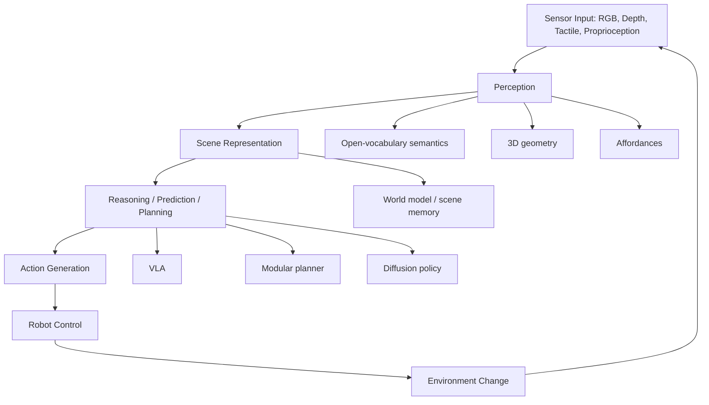

# Overview Roadmap

> **Last Updated:** 2026-06-11
> **Level:** Advanced
> **Why It Matters for Robotics:** Embodied foundation models place visual representation learning inside a perception-memory-reasoning-action loop, where errors alter the next observation and can cause physical failure. Overview Roadmap must be evaluated by its effect on physical decisions, not only by passive recognition accuracy.
> **Related Sections:** [VLA Model Architectures](01_vla_model_architectures.md), [Knowledge Base Index](../INDEX.md)

## Overview

A VLA maps visual observations, language, and robot state to actions, often by adapting a pretrained VLM and adding an action decoder. Architectures differ in action tokenization, continuous regression, diffusion or flow heads, action chunking, memory, and control hierarchy. The central constraint is multi-timescale operation: semantic reasoning can run at a few hertz, while stable contact and whole-body control may require tens to hundreds of hertz. World models instead learn predictive state transitions and can support imagination or planning; hybrid systems increasingly combine both.

The robotics-first question is not whether a model can describe an image, but whether it can maintain the right state for intervention. Relevant state includes pose, free space, articulation, support, containment, material, contact, uncertainty, and expected change under action. Because actions alter observations, perception and control form a coupled dynamical system. This makes calibration, temporal consistency, recovery, and out-of-distribution detection first-class research concerns.

The contemporary stack has four coupled layers. Perception converts sensor streams into object, geometry, motion, contact, and uncertainty estimates. Scene representation and memory maintain those estimates across occlusion and action. Reasoning or prediction selects subgoals, estimates consequences, and decides when more information is needed. Action generation and control produce embodiment-specific trajectories and close the loop at hardware-relevant rates. VLAs compress several layers into one trained system; modular planners keep interfaces explicit; world models predict transitions; diffusion or flow policies model local action distributions.

The important change from classical robot perception is not that detection disappeared. Detection, segmentation, pose, tracking, mapping, and calibration still occur either explicitly or inside learned features. What changed is the training objective and interface: perception is increasingly optimized jointly with language and action, and representations may be latent rather than human-labeled. This can preserve task-relevant cues that a hand-designed interface omits, but it also makes geometry, uncertainty, and failure causes harder to inspect.

A plausible near-term architecture is hierarchical and asynchronous. A large multimodal model performs open-vocabulary interpretation and task decomposition at low frequency; an object-centric 3D memory maintains persistent state; a predictive model evaluates candidate transitions; and a compact reactive policy executes action chunks under safety constraints. Figure's Helix makes the timescale split explicit, while pi0.5 combines high-level textual subtask prediction with a continuous flow-matching action expert. These are design points, not proof that hierarchy is solved: both persistent memory and recovery remain weakly evaluated.

## Core Technical Ideas

1. **Task-conditioned sufficiency.** Representations should retain variables required by the controller while excluding nuisance variation. The sufficient state differs for collision avoidance, insertion, cloth folding, and language-conditioned search.
2. **Geometry plus semantics.** Metric structure supports reachability and collision checking; semantics identifies task-relevant entities and likely functions. Either alone is inadequate in open-world scenes.
3. **Temporal and causal grounding.** Tracking and memory distinguish persistent state from transient appearance. Action-conditioned observations reveal articulation, mass, friction, compliance, and hidden constraints.
4. **Uncertainty and abstention.** Robots need calibrated confidence, anomaly detection, and information-gathering actions. A plausible but wrong prediction is more dangerous than an explicit request for another view or human help.
5. **Closed-loop evaluation.** Dataset metrics isolate components, but deployment requires measuring task success, intervention rate, recovery, latency, and performance across hours, scenes, and hardware conditions.

Architecturally, modular pipelines expose intermediate state and allow geometric verification, while end-to-end policies optimize the final behavior and can exploit cues that annotations omit. Hybrid systems use pretrained visual-language features for semantics, explicit maps or object memories for persistence, learned action generators for local control, and classical safety or motion constraints around execution.

## Why This Matters in Robotics

Manipulation converts millimeter-scale pose, depth, or contact errors into missed grasps and collisions. Navigation compounds localization drift and stale semantic memory over long trajectories. Human-robot interaction adds uncertain intent and safety margins. Real robots also face reflective and transparent materials, self-occlusion, changing illumination, sensor dropout, actuator delay, and objects absent from training.

Consequently, a credible result should state the embodiment, sensors, control frequency, inference hardware, environment split, number of trials, reset policy, intervention policy, and failure taxonomy. Generalization claims should name the axis held out: objects, layouts, tasks, instructions, embodiments, dynamics, or time. Aggregating these axes into a single success number conceals where the system actually transfers.

## Formal Problem Formulation

A VLA policy models an action sequence conditioned on multimodal history and a
goal:
\[
\pi_\theta(a_{t:t+H-1}\mid o_{t-K:t},q_{t-K:t},\ell,e),
\]
where \(q\) is proprioception, \(\ell\) is language, and \(e\) identifies the
embodiment or action convention. The horizon \(H\), observation window \(K\),
control rate, and execution strategy are part of the model definition. A
one-step policy, an open-loop action chunk, and a receding-horizon diffusion
policy induce different closed-loop systems even when trained on the same
trajectories.

For **Overview Roadmap**, the paper-level specification should name the random variables,
coordinate frames, prediction horizon, and decision interface. It should also
state assumptions that are often hidden: static versus dynamic scene,
calibrated versus drifting sensors, known versus open-set objects, rigid versus
deformable interactions, and whether test-time adaptation or human correction
is allowed. These assumptions define the actual problem more precisely than the
model name.

### A Taxonomy by Information Flow

The most informative taxonomy separates systems by where information is
compressed. In a monolithic policy, image, language, proprioception, and action
tokens share a backbone and the only externally visible state is the action.
In a hierarchical policy, a slow model predicts a subgoal, latent plan, or
semantic embedding consumed by a fast controller. In a modular stack, explicit
objects, maps, trajectories, or constraints cross component boundaries. In a
model-based agent, candidate actions are evaluated through predicted future
states. These choices determine not only accuracy but also debuggability,
latency, data reuse, and where safety constraints can be inserted.

The roadmap should therefore be read along four axes. **Representation** asks
whether state is token-based, object-centric, metric 3D, or an unstructured
latent. **Action generation** asks whether outputs are discrete tokens,
continuous regression, diffusion samples, flow trajectories, or references for
a lower-level controller. **Temporal organization** asks whether the system is
reactive, chunked, recurrent, memory-augmented, or explicitly hierarchical.
**Learning signal** asks how web data, video, demonstrations, simulation,
autonomous rollouts, and preferences contribute. A credible paper identifies
its position on all four axes and ablates the claimed source of progress.

### Research Milestones

A useful progression is harder than a sequence of larger demonstrations.
First, establish repeatable single-skill control under object and viewpoint
variation. Second, test compositional instructions while holding motor skills
fixed. Third, introduce persistent state changes and require recovery from
failed subgoals. Fourth, transfer across scenes and embodiments with a declared
adaptation budget. Fifth, evaluate unattended operation and calibrated
abstention. Each stage should preserve the earlier controls, otherwise apparent
long-horizon progress can come from easier resets, more permissive success
criteria, or hidden human assistance.

## Experimental Design at a CVPR / Robotics Research Standard

### Hypotheses and Baselines

Begin with a falsifiable hypothesis, not “our model improves performance.” A
strong hypothesis identifies a mechanism: temporal memory should improve
performance specifically after occlusion; metric 3D state should improve
viewpoint transfer; tactile input should help after first contact; heterogeneous
pretraining should reduce target-domain sample complexity. Select baselines that
isolate that mechanism: a matched-capacity model without the component, a
classical or modular alternative, and a strong current system evaluated through
the same observation and action interface.

Match data, optimization steps, augmentations, action horizon, and deployment
frequency wherever possible. Parameter count alone is not a sufficient control
because frozen pretraining, context length, image resolution, and sampling steps
change effective compute. Report training FLOPs or accelerator-hours and
measured inference latency. When exact matching is impossible, disclose the
asymmetry and include a resource-performance curve rather than a single point.

### Splits, Leakage, and Generalization

The experimental unit should be the factor intended to generalize: object
instance, physical scene, building, operator, task template, robot, or collection
day. Randomly splitting adjacent frames leaks appearance and state. Randomly
splitting demonstrations from the same reset can leak trajectories. Language
templates can leak task identity even when object instances are new. Construct
grouped splits before training and publish the group identifiers.

Report in-distribution performance separately from each held-out axis and from
their composition. “Unseen” must say unseen in what sense. A novel object in a
known category and pose is different from an unknown category, and an unseen
instruction paraphrase is different from a new physical skill. For pretrained
models, audit likely overlap with public datasets and avoid claiming strict
zero-shot novelty when pretraining provenance is unknown.

### Statistics and Reporting

Closed-loop trials are Bernoulli or ordinal outcomes with substantial
environmental variation. Report the numerator and denominator, not only a
percentage. Include confidence intervals such as Wilson intervals for success
rates, stratify by scene or task, and use hierarchical bootstrap when trials are
nested within objects or environments. Run enough independent seeds to expose
optimization variance and enough physical trials to expose deployment variance.
Do not treat thousands of video frames from one episode as independent samples.

Average success should be accompanied by worst-group performance, time to
completion, interventions, safety violations, recovery success, and a failure
taxonomy. Pre-register success criteria for ambiguous tasks and score videos
blind to method when human judgment is required. Preserve failed runs and
timeouts in the released logs.

## Diagnostic Ablations and Failure Analysis

Ablations should remove information or capacity in a way that tests the claimed
causal story. Useful interventions include removing temporal context, shuffling
language, withholding proprioception, perturbing calibration, delaying one
modality, replacing predicted geometry with ground truth, and replacing the
planner or controller with an oracle. Oracle studies locate the bottleneck:
ground-truth pose tests the perception gap, ground-truth subgoals test the
reasoning gap, and replay under a validated controller tests the action gap.

Stress tests should vary lighting, clutter, occlusion, camera pose, distractors,
reflective or transparent materials, actuator delay, and scene rearrangement.
For each failure, record the earliest observable precursor and whether the
system's confidence changed before the physical error. A useful taxonomy
separates sensing failure, state-estimation failure, grounding failure, planning
failure, control failure, and invalid evaluation assumptions. “Policy failed”
is not an analysis.

## Reproducibility Checklist

- Publish exact train, validation, and test episode identifiers.
- Record robot model, end effector, sensors, calibration procedure, and control interface.
- State observation rate, policy rate, action horizon, executed chunk length, and latency distribution.
- Release action normalization, coordinate-frame conventions, preprocessing, and success predicates.
- Report model initialization, frozen modules, optimizer, schedule, augmentations, seeds, and compute.
- Preserve per-trial outcomes, intervention logs, reset policy, exclusions, and representative failures.
- Distinguish simulation, replay, human teleoperation, autonomous execution, and post-selected video.
- Document licenses, privacy constraints, safety limits, and any unavailable proprietary training data.

## Thesis-Level Research Questions

1. Which latent variables are necessary and sufficient for overview roadmap, and
   how can sufficiency be tested through interventions rather than probes alone?
2. Under which distribution shifts does the proposed representation fail
   gracefully, become miscalibrated, or produce confidently unsafe actions?
3. What is gained by end-to-end learning after matching data, compute, control
   rate, and privileged geometric information against a modular baseline?
4. Can active perception or contact reduce uncertainty more efficiently than
   increasing model size or demonstration count?
5. How does performance scale with independent changes in task diversity,
   environment diversity, embodiment diversity, and trajectory count?
6. Which failures are detectable early enough for abstention, replanning, or
   human assistance, and what is the cost of those safeguards?

## Key Systems / Methods / Papers

| Name | Year | Type | Why It Matters |
|------|------|------|----------------|
| RT-1 | 2022 | robot transformer | Scaled multi-task real-robot behavior |
| RT-2 | 2023 | VLA | Represented actions as language-like tokens |
| OpenVLA | 2024 | open VLA | Released a reproducible 7B VLA |
| Octo | 2024 | open policy | Generalist transformer trained across robot datasets |
| pi0 | 2024 | flow VLA | Used a flow-matching action expert |
| Helix | 2025 | humanoid VLA | Separated 7-9 Hz semantics from 200 Hz control |

These systems should not be read as a linear leaderboard. They make different assumptions about calibration, data access, action spaces, environment structure, and evaluation. The most useful comparison asks which assumptions remain valid in the target robot deployment.

## Benchmarks / Datasets / Evaluation

| Benchmark or Dataset | Task | Metric | Why It Matters |
|----------------------|------|--------|----------------|
| Open X-Embodiment | cross-embodiment policy learning | per-task success | Aggregates heterogeneous robot experience |
| LIBERO | lifelong manipulation | task success | Tests transfer and interference |
| CALVIN | language-conditioned long horizon | sequence completion | Measures chained skill execution |

Offline metrics are necessary for diagnosis but insufficient for robotics. Add closed-loop success, time-to-completion, collision or damage rate, human interventions, recovery success, calibration error, worst-group performance, and confidence calibration. Report uncertainty across trials and environments rather than selecting demonstration videos.

## Pros, Limits, and Failure Modes

| Dimension | Strength | Limitation |
|-----------|----------|------------|
| Learned representations | Transfer semantics and exploit large heterogeneous datasets | Can encode dataset shortcuts and lose metric consistency |
| Explicit geometry | Interpretable, measurable, and compatible with planning | Brittle under missing depth, dynamics, deformability, and calibration error |
| End-to-end policies | Optimize behavior and reduce hand-designed interfaces | Difficult to audit; failures couple perception, reasoning, and control |
| Modular systems | Components can be tested, replaced, and safety-checked | Interface errors and task-irrelevant objectives can cap performance |
| Simulation | Scalable labels, interventions, and rare-event generation | Appearance, contact, dynamics, and behavior gaps can compound |
| Open-vocabulary models | Recognize long-tail concepts and flexible instructions | Semantic similarity does not establish pose, reachability, or affordance |

Common failures include occlusion-induced identity switches, reference-frame confusion, stale memory after an object moves, confidently hallucinated objects, depth failure on transparent surfaces, temporal lag during contact, and policies that succeed only from narrow reset distributions. Recovery behavior is often undertrained because datasets overrepresent successful demonstrations.

## Open Problems

- Build persistent 3D/4D memory that updates after robot and human interventions without catastrophic drift.
- Calibrate semantic, geometric, and action uncertainty into a common decision-relevant quantity.
- Learn affordances and contact dynamics that transfer across object instances, materials, and embodiments.
- Evaluate long-horizon autonomy with transparent resets, interventions, failures, and confidence intervals.
- Combine web-scale priors with robot data without importing visual shortcuts or unsafe commonsense assumptions.
- Adapt online to sensor, calibration, environment, and hardware change without forgetting safety constraints.
- Develop representations for deformables, transparent objects, articulated mechanisms, and multi-agent interaction.

## Connections to Neighboring Topics

This topic sits between sensing and control. It depends on the foundations in `02_robot_perception_foundations`, gains spatial structure from `04_3d_and_spatial_understanding`, and connects semantics and contact through `05_multimodal_perception`. Its ultimate value is tested in `08_manipulation_navigation_and_control`; data and reproducibility constraints are covered in `07_data_simulation_and_training`.

## Further Reading

- [Open X-Embodiment / RT-X](https://robotics-transformer-x.github.io/)
- [OpenVLA](https://openvla.github.io/)
- [Octo](https://octo-models.github.io/)
- [Physical Intelligence pi0](https://www.pi.website/blog/pi0)
- [Physical Intelligence pi0.5](https://www.pi.website/blog/pi05)
- [Figure Helix](https://www.figure.ai/news/helix)
- [Gemini Robotics](https://deepmind.google/blog/gemini-robotics-brings-ai-into-the-physical-world/)
- [NVIDIA GR00T](https://developer.nvidia.com/isaac/gr00t)
- [Robotics: Science and Systems proceedings](https://www.roboticsproceedings.org/)
- [CoRL proceedings](https://proceedings.mlr.press/)
